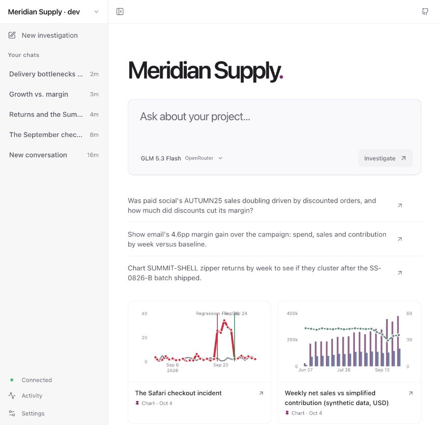
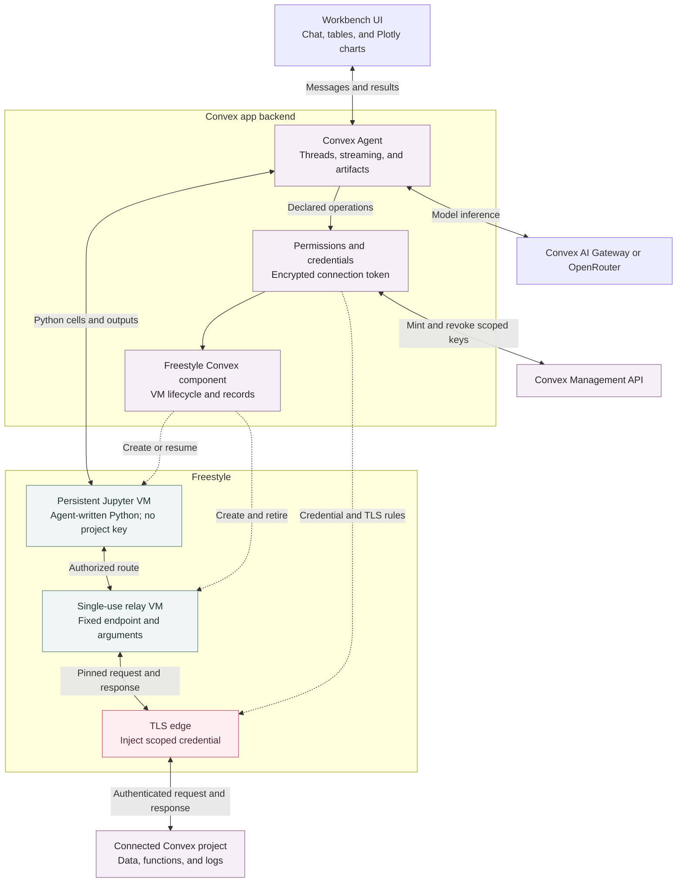

# Freestyle for Convex

Manage long-lived [Freestyle VMs](https://www.freestyle.sh/docs/vms) from Convex
actions while keeping a reactive record of each VM in Convex.

Freestyle VMs are the most powerful VMs for AI agents. They are full Linux
machines with root access, Docker, systemd, nested virtualization, FUSE, eBPF,
and full Linux networking. VMs start quickly, preserve memory when paused, and
can be snapshotted or branched from an exact machine state.

The component provides:

- idempotent VM creation with retry recovery;
- cached VM lifecycle and resource state for reactive queries;
- create, refresh, start, pause, resize, update, exec, snapshot, and delete
  helpers;
- explicit tenant isolation through an app-supplied `ownerId`; and
- protection against adopting an unrelated Freestyle VM with the same slug.

## Workbench: investigate a Convex project with an agent

[Workbench](./agent-demo/README.md) is a complete demo built with this
component, Convex Agent, and Freestyle. Connect an existing Convex deployment,
ask a question, and let the agent inspect its data and logs, run Python, and
turn the results into interactive charts and sortable tables. Open a chart to
refine it in its own chat; the updated version replaces the large view and can
be undone.



The screenshot uses **Meridian Supply**, a fictional retailer with **146,233
records across 19 tables**: customers, orders, payments, shipments, returns,
inventory, marketing, and operating metrics over 120 days. The dataset contains
discoverable problems, including a Safari checkout regression, a shipping
backlog, a defective product batch, and a campaign that grows sales while
shrinking margins. All of the displayed business data is synthetic.

Try **“Are we growing profitably? Chart it.”** Other short questions:

- “Why did checkout failures spike?”
- “Which products are being returned?”
- “Where are deliveries getting stuck?”

The demo has streaming conversations, visible notebook calls and results,
concurrent chats, persistent Python state, artifact URLs and version history,
and a choice of Convex AI Gateway or OpenRouter. Reads run without an approval
prompt; mutations, document edits, and actions require approval of the exact
operation and arguments. Investigations start from user messages.

See the [app setup](./agent-demo/README.md#try-the-interface) and
[reproducible Meridian dataset](./agent-demo/meridian-demo/README.md).

## How Convex, Freestyle, and network secrets fit together

Convex runs the agent and stores its conversations, settings, approvals, and
artifact versions. Freestyle runs the Python work. The persistent notebook VM
gets a single-use network route; a separate trusted relay fixes the target
request, and Freestyle injects the scoped Convex credential at the TLS edge.



1. **Authorize the operation.** The Convex backend checks workspace ownership,
   the connected deployment, and the current permission revision. Reads proceed;
   writes wait for a one-time approval bound to the Python cell and its
   requests.
2. **Provision narrow access.** The backend uses the encrypted connection token
   to mint a deployment key scoped to the required operation class, such as log
   reading or query execution. Native key scopes are combined with exact
   endpoint and argument enforcement in the relay and network rules.
3. **Execute without handing Python a key.** The notebook calls
   `request_json(i)`. Its route reaches only the trusted relay, which consumes
   one fixed request. The outbound TLS rule is tied to the relay's VM ID, target
   hostname, method, and path; it adds the authorization header and any required
   secret body field. Credentials are supplied to Freestyle's control plane, not
   the notebook's environment, files, or model context.
4. **Return results and retire access.** The response comes back through the
   relay to Python. Validated Plotly data and tables stream into the UI through
   Convex. The notebook survives for follow-ups; the request is sealed and
   relay/rule deletion and key revocation run through scheduled cleanup.

Read routes can be prepared ahead of a cell, but remain dormant until bound to
an authorized request. Writes are provisioned only after approval. Native keys
have a 31-minute expiry as a fallback; route consumption and cleanup make their
normal usable lifetime much shorter. The app uses the Freestyle Convex component
for VM lifecycle and the Freestyle SDK for TLS rules, filesystem operations, and
execution. See
[Freestyle outbound TLS](https://www.freestyle.sh/docs/vms/network/tls-outbound)
and the app's
[access details](./agent-demo/README.md#how-granular-access-works).

## Use the component in your own app

The rest of this README covers the reusable `@freestyle-sh/convex` package.
Workbench's agent, permissions, credential broker, and UI live in `agent-demo/`;
installing the component alone provides the VM lifecycle API described below.

## Install

```sh
npm install @freestyle-sh/convex
```

Register the component in `convex/convex.config.ts`:

```ts
import { defineApp } from "convex/server";
import freestyle from "@freestyle-sh/convex/convex.config.js";

const app = defineApp();
app.use(freestyle);

export default app;
```

Set a Freestyle account API key on the Convex deployment:

```sh
npx convex env set FREESTYLE_API_KEY your-api-key
```

Create an API key from the [Freestyle dashboard](https://dash.freestyle.sh) or
with the CLI:

```sh
npx freestyle@latest login
npx freestyle@latest tokens create convex
```

## Create an authenticated API

Instantiate the component client in your app's `convex/` directory. Convex
components cannot authenticate your app's users, so the wrapper must derive
`ownerId` from trusted auth state. Do not accept `ownerId` as a client argument.

```ts
import { v } from "convex/values";
import { Freestyle } from "@freestyle-sh/convex";
import { components } from "./_generated/api.js";
import { action, query } from "./_generated/server.js";

const freestyle = new Freestyle(components.freestyle);

async function ownerId(ctx: {
  auth: { getUserIdentity(): Promise<{ subject: string } | null> };
}) {
  const identity = await ctx.auth.getUserIdentity();
  if (!identity) throw new Error("Unauthenticated");
  return identity.subject;
}

export const createWorkspace = action({
  args: { slug: v.string() },
  handler: async (ctx, { slug }) => {
    return await freestyle.create(ctx, {
      ownerId: await ownerId(ctx),
      slug,
      snapshotId: "freestyle/ubuntu",
      idleTimeoutSeconds: 600,
      firewall: {
        rules: [{ action: "allow", source: {}, destination: { public: true } }],
      },
    });
  },
});

export const listWorkspaces = query({
  args: {},
  handler: async (ctx) => {
    return await freestyle.list(ctx, { ownerId: await ownerId(ctx) });
  },
});
```

Freestyle has a default-deny network model, so `firewall` is required. Use
`{ rules: [] }` for an isolated VM, or declare only the traffic the workload
needs. See the [Freestyle quickstart](https://www.freestyle.sh/docs/quickstart)
for firewall examples.

## Lifecycle and commands

Mutating operations make external requests and must run in Convex actions:

```ts
await freestyle.start(ctx, { ownerId, slug });
await freestyle.pause(ctx, { ownerId, slug });

const result = await freestyle.exec(ctx, {
  ownerId,
  slug,
  options: { command: "git status --short", timeoutMs: 300_000 },
});

await freestyle.resize(ctx, {
  ownerId,
  slug,
  options: { cpu: 8, memory: 16 * 1024, storage: 80 * 1024 },
});

const snapshot = await freestyle.snapshot(ctx, {
  ownerId,
  slug,
  options: { slug: `${slug}-configured` },
});

await freestyle.delete(ctx, { ownerId, slug });
```

`get` and `list` read cached records and can run in reactive Convex queries.
Call `refresh` from an action when the application needs the current remote
state:

```ts
const cached = await freestyle.get(ctx, { ownerId, slug });
const current = await freestyle.refresh(ctx, { ownerId, slug });
```

## Creation and retries

`create` requires a stable Freestyle `slug`. The component reserves a Convex
record first and adds a random ownership marker to the VM's Freestyle metadata.
If the action is retried after the remote VM was created but before the Convex
record was linked, the client finds the VM by slug and verifies that marker
before linking it. A VM with the same slug and a different marker is rejected.
The component reserves the `convex_component_id` metadata key and one of
Freestyle's 64 VM metadata entries.

Freestyle slugs are account-wide. Two owners may use the same logical name in
Convex, but their remote VM slugs still need to be unique within the Freestyle
account. Prefix or hash tenant identifiers when generating slugs for a
multi-tenant app.

## Configuration

The constructor reads `FREESTYLE_API_KEY` from the consuming Convex app by
default. Explicit options support multiple Freestyle accounts and local API
testing:

```ts
const freestyle = new Freestyle(components.freestyle, {
  apiKey: process.env.SECONDARY_FREESTYLE_API_KEY,
  baseUrl: "https://api.freestyle.sh",
});
```

Each separately registered Convex component instance has its own tables. Each
`Freestyle` client may also use a different API key.

## Development

```sh
npm install
CONVEX_AGENT_MODE=anonymous npx convex init
npm run build:codegen
npx convex codegen --typecheck disable
npm test
npm run typecheck
npm run lint
npm run format:check
```

The full backend-only example is in [`example/convex`](./example/convex).
