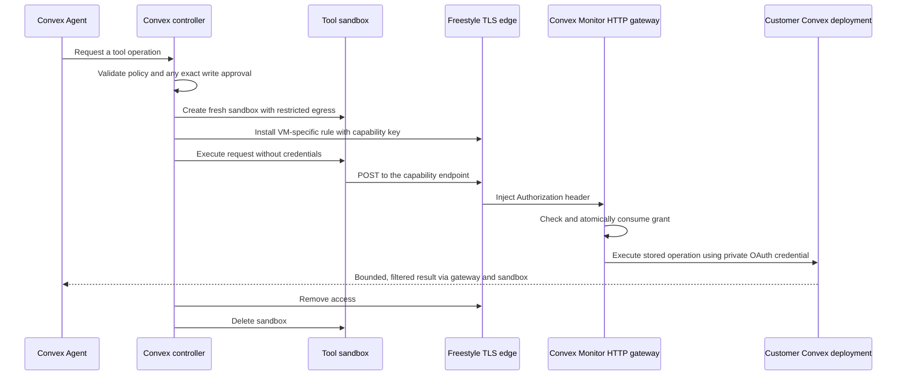

# Connected projects and per-tool credentials

The team-token connection path and fresh native per-tool keys are now implemented
in browser-owned demo workspaces. See [README.md](./README.md) for the current flow.
This document also describes future registered accounts, OAuth, and per-session/run
policy controls; those are not implemented. A Monitor-issued gateway remains an
unaccepted alternative, not the current credential path.

The requested connection model retains enough server-side authority to provision
and revoke fresh keys for the connected project. Prefer independent native
Convex keys where the connection credential supports this. The Monitor-issued
gateway key below is an alternative, not an accepted replacement for that goal.

## Access boundaries

A customer connects a Convex project once. Conversations retain history; every
prompt starts a new run, and each network tool gets a separate grant. Autonomous
work is currently disabled; webhooks only store evidence.

Effective access is the intersection of:

- The customer's current project connection and underlying Convex authority.
- The explicit permission settings for the conversation.
- The run's permission snapshot, which can narrow but never expand that access.
- The exact operation selected by the tool.
- A valid human approval for the exact function and arguments, for writes.

Prompt text and model output cannot grant permissions. Editing permissions or
disconnecting a project invalidates outstanding grants. A request already sent
to the target cannot be recalled; uncertain writes must not be retried silently.

## Connection and key choices

Use Convex's project-scoped OAuth authorization-code flow with S256 PKCE for
one-click connections. The OAuth callback belongs to the Convex backend. Store
the upstream credential encrypted server-side and bind the connection to an
authenticated Monitor account. OAuth authorizes a project; it is not, by itself,
an end-user identity system for Monitor.

Convex's native `create_deploy_key` endpoint accepts `allowedActions` and
`expiresAt`. It can scope a newly created key to one deployment and operation
categories such as viewing logs or running internal queries. Native expiry must
be at least 30 minutes away. The documented request does not accept individual
function names or argument constraints.

However, the endpoint explicitly says OAuth-authenticated calls reuse the
OAuth-granted token. Do not label the returned value a new narrower credential,
or revoke it as though it were an independent per-run key.

Two distinct implementation paths are possible; do not silently substitute one
for the other:

1. **OAuth with Monitor-issued capability keys (alternative).** Monitor creates
   a random, short-lived key for a single stored operation. Its Convex HTTP
   gateway validates and consumes the key, then performs that operation with the
   private upstream OAuth credential. This key authenticates to Monitor, not to
   Convex's native deployment API.
2. **Native scoped deploy keys.** A supported non-OAuth management credential
   mints a native deployment key with explicit allowed actions. Freestyle's rule
   supplies narrower method/path/body restrictions. Revoke the native key on
   completion and retain its expiry as a fallback. This path does not resolve
   customer OAuth onboarding by itself, and replay prevention for writes still
   requires an application-level enforcement point or target idempotency.

## Where injection happens

For the recommended OAuth path:

The controller creates the rule using `freestyle.tls.rules.create`:

- `source.vmId` identifies exactly the tool's sandbox.
- `domain` is the Monitor gateway's fixed hostname.
- `match` restricts the method and exact capability endpoint path.
- `transform.headers.Authorization` contains the per-tool capability key.

The key is configured on the Freestyle edge. It is not sent to the model,
browser, command line, filesystem, or VM environment. Freestyle redacts stored
header secrets on readback. The gateway uses its stored operation; caller-supplied
target URLs, function paths, or arguments never replace the grant's values.

The existing direct-key path instead injects `Authorization: Convex <key>` on a
request to the customer's `.convex.cloud` hostname and pins function arguments
with a JSON transform. The implementation is in `convex/lib/sandbox.ts`.

## Grant lifetime and records

Each grant records the owning connection, project, conversation, run, sandbox,
policy revision, exact operation, expiry, approval reference when applicable,
token hash, and state. Generate an unpredictable key server-side and store only
its hash in the grant record; the plaintext is supplied to the edge when the
rule is created. The connection secret is stored separately and never exposed
through project-list or chat queries.

Use a short execution window, for example three minutes, and one successful
atomic claim per grant. Consume before forwarding the request, including reads;
an allowed retry requires a new grant. Record success, failure, or uncertain
execution independently from consumption.

The gateway rechecks ownership, connection state, current policy revision, run
state, expiry, operation, and the write approval in the claim transaction.
Freestyle enforces source-VM access; the gateway must not trust a VM ID supplied
in an ordinary client header as proof of origin.

Normal completion revokes the grant and deletes the VM/rule. A scheduled cleanup
handles interrupted actions, while the gateway's expiry check independently
prevents later use. Native keys, where used, need their own revocation record and
retryable cleanup; deleting a VM alone does not revoke a native Convex key.

Never add a later write credential to a VM that ran earlier agent-written code.
Surviving processes could exercise the new authority. Start a fresh tool sandbox;
only explicitly selected data moves between tools.

## What is already present

- Convex Agent threads and user-requested prompt runs; passive webhook evidence.
- Project permission settings, exact function allowlists, and approved writes.
- Fresh per-tool Freestyle VMs, VM-specific edge injection, pinned request bodies,
  bounded execution, and VM cleanup.
- Existing-project discovery with a team token, verified deployment connection,
  encrypted credential storage, duplicate connection reuse, and disconnect/reconnect.
- Native per-tool key minting, exact scope/expiry checks, revision checks before
  activation, immediate revocation and scheduled retry/expiry cleanup.
- Legacy pre-provisioned environment credentials remain supported.

Browser-workspace isolation is implemented. Not yet implemented: registered customer
accounts, account recovery, OAuth connection/callback,
conversation/run permission controls, or Monitor-issued capability keys and their
gateway. Live validation connected an existing development deployment using a
one-year team token, including native logs-only key creation, log access, revocation,
encrypted persistence, and browser reload. See VALIDATION.md for the remaining gaps.

## Required validation before customer use

Verify OAuth state/session binding, PKCE and callback replay protection; ownership
checks on every public query, mutation, action and stream; connection-secret
redaction; isolation across projects, threads and runs; denial after permission
changes or disconnect; one-winner concurrent grant claims; expiry; altered URLs
and arguments; write approval binding; cleanup after interruption; and no retry
of an uncertain write. Live checks must demonstrate edge injection without a
guest-readable key and the exact downstream operation on a disposable project.

## Sources

- [Convex OAuth applications](https://docs.convex.dev/platform-apis/oauth-applications)
- [Create deploy key](https://docs.convex.dev/management-api/create-deploy-key)
- [Delete deploy key](https://docs.convex.dev/management-api/delete-deploy-key)
- [Convex Management OpenAPI](https://api.convex.dev/v1/openapi.json)
- [Freestyle outbound TLS](https://www.freestyle.sh/docs/vms/network/tls-outbound)
