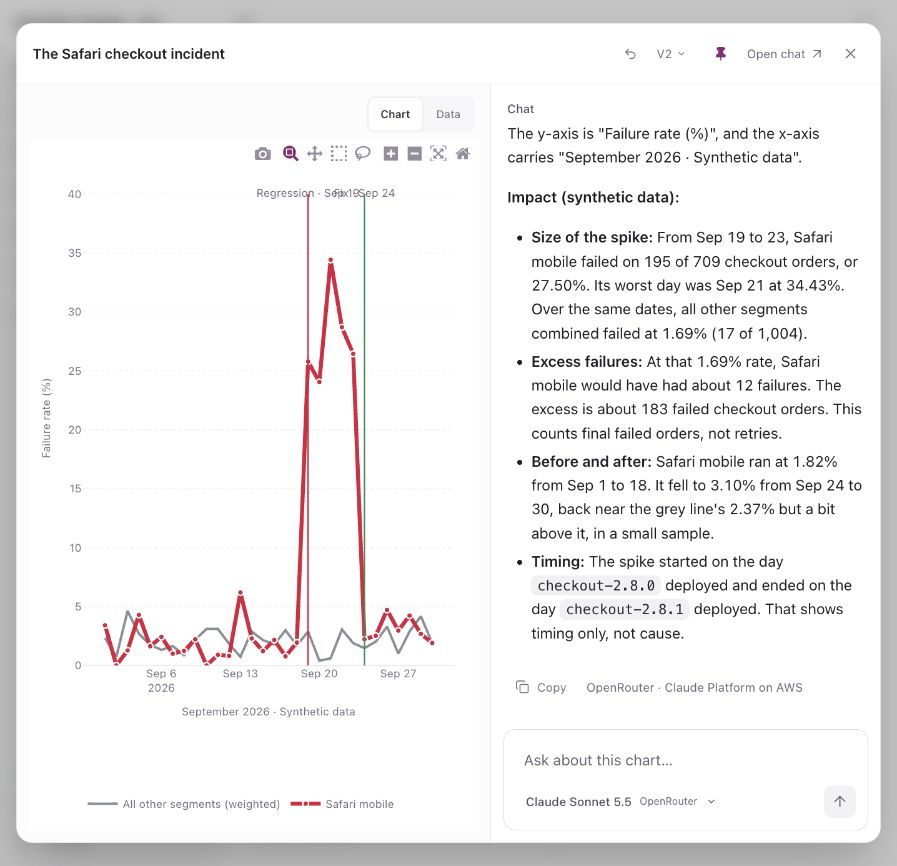

# Workbench

A demo operations agent for connected Convex deployments. Convex owns persistent
agent threads, evidence, findings, passive log ingestion, and
approval state. Freestyle runs agent-written Python in a persistent Jupyter VM.
Cells receive single-use network routes for exact approved project requests;
credentials are injected at the TLS edge of isolated Python relay VMs.
Notebook figures render as interactive Plotly.js charts in chat.

Connect your Convex project, ask about its data or behavior, and build an
investigation you can keep working with. Charts and tables are interactive
artifacts: open one at its own URL, ask a follow-up in the right-hand chat, and
watch the main result update with version history and undo.



Start with **“Are we growing profitably? Chart it.”** The
[Meridian Supply demo](./meridian-demo/README.md) has 146,233 synthetic records
across 19 tables and 120 days, including checkout failures, shipping delays,
product defects, and campaign economics. Its prepared investigations include
charts and sortable tables. The smaller [test project](./test-project/README.md)
also contains repair mutations for testing one-time write approvals.

See the [architecture diagram](../README.md#how-convex-freestyle-and-network-secrets-fit-together)
for the complete Convex → Jupyter → relay → secret-injection flow.

## Stack

| Responsibility                                                   | Runs on                                                             |
| ---------------------------------------------------------------- | ------------------------------------------------------------------- |
| Agent orchestration, persistent threads, messages, and streaming | Convex Agent component inside Convex actions                        |
| Project settings, evidence, permissions, and approvals           | Convex tables, queries, and mutations                               |
| Run watchdogs and evidence retention                             | Native Convex scheduled functions                                   |
| Signed log webhook ingress                                       | Convex HTTP actions                                                 |
| Isolated execution and scoped credential injection               | Freestyle VMs and TLS injection, controlled by Convex actions       |
| Language-model inference                                         | Convex AI Gateway (default) or OpenRouter, through the Convex Agent |
| Browser interface                                                | TanStack Start, TanStack Router, React, and Tailwind CSS 4          |

The application backend is Convex plus Freestyle. Convex AI Gateway or OpenRouter supplies
model inference. TanStack Start uses its Vite plugin and SPA mode for the web
application; workspace credentials and Convex subscriptions initialize in the
browser. No agent execution or project credentials move into the web server.

Chat links, artifact cards, the Workspace/New investigation controls, and project
options preload their Convex read queries on hover or keyboard focus (80 ms), or
immediately on pointer-down. The first 30 messages and view details stay live in
the same Convex client cache for 30 seconds, with at most three destinations kept
warm. Leaving before the delay cancels the work. Hidden tabs, offline mode, and
browser data-saving mode skip speculative loading. No agent runs or sandbox
operations start until requested.

Tailwind uses the [official Vite integration](https://tailwindcss.com/docs/installation/using-vite).
Component layout, responsive states, tool cards, approvals, and settings use
utility classes in `src/Workspace.tsx`, `src/Configuration.tsx`, and
`src/ProjectSwitcher.tsx`, with shared theme tokens, system fonts,
and a consistent spacing scale. `src/styles.css` holds
document/form defaults and the activity animation. Prettier sorts Tailwind
classes automatically.
The project switcher uses Radix Dropdown Menu for keyboard navigation,
selection, focus management, and viewport positioning.
The composer, chat styling, and color/shadow tokens adapt the MIT-licensed
[Beautiful UI](https://www.beautifului.dev/) Prompt Bar and Chat examples. The
adaptation and original license live in `src/components/beautiful-ui/`.

## Try the interface

From the repository root:

Use Node.js 22.12 or newer.

```sh
npm ci
npm run build
cd agent-demo
npm ci
npm run dev
```

The UI opens a private workspace automatically and remembers it in this browser.
It starts with the real **Connect Convex** flow. No operator token, backend URL,
terminal, or environment-variable configuration is required from app users.

The parent component is consumed through a local file dependency. The .npmrc
enables install-links so npm packs it instead of creating a symlink with
conflicting Convex dependency versions. Build the parent before installing.

`npm run build` produces the static SPA in `dist/client`, including the generated
`_shell.html`. Static hosts must serve existing assets normally and rewrite other
paths to `/_shell.html` with status 200 so direct chat URLs work. A `_redirects`
file is included for hosts that support that format. The optional `dist/server`
output is Start's server build; the application backend remains Convex.
Use `npm run preview` to check the production build locally through Start.

## Conversations first

The interface follows Convex's
[official streaming chat example](https://github.com/get-convex/agent/blob/main/example/ui/chat/ChatStreaming.tsx):
`useUIMessages`, `listUIMessages`, `syncStreams`, and saved stream deltas from
the Agent component. Tool inputs/results render from the actual message parts;
Markdown replies render incoming provider chunks directly, without a simulated
typing delay. Convex publishes deltas at up to 50 ms intervals; a small cursor
marks the live response instead of a separate three-dot indicator.

- **Your chats:** create persistent Agent threads, send messages, and resume
  them.
- **Concurrent investigations:** different chats on the same project run
  independently. Send a follow-up while a chat is working; it is saved immediately
  and shown as waiting for the next step. The current model/tool step finishes,
  then the Agent picks up the next message with the existing conversation and tool
  results. It does not wait for the whole investigation to finish. Each message
  retains its selected model; Jupyter cells remain serialized within their chat.
- **Inline approvals:** inspect the exact function and arguments, then approve
  or decline. Decisions and execution outcomes become part of the Agent's saved
  conversation so subsequent turns know what happened.
- **Status and settings:** connection and activity indicators sit in the left
  sidebar. Settings → Activity contains approvals, runs, captured project logs,
  and sandbox receipts; logs and failed runs can be attached to chat. Connection
  details, token expiry, and access controls live in Settings → Project.
- **Data investigations:** ask the Agent to inspect tables and records in chat.
  It can propose one-document edits through notebook requests for approval.

The app maps each Agent thread to exactly one project. Message reads, follow-up
runs, and conversation evidence queries enforce that mapping. Proposal and
sandbox lists are scoped to the selected conversation's runs. Existing projects
retain access to their original thread. Investigations start only from user prompts.

Run timeouts start when a queued message begins execution. Finishing or timing out
a run schedules the next message in that chat; it does not affect another chat's
tools or notebook. Chats can be deleted while work is running: deletion removes
their runs and approvals immediately, rejects late results, and schedules notebook
and network cleanup in the background. Deletion cannot undo a project write that
was already sent. Connection replacement/disconnect checks all queued/running
chats and approved operations before changing credentials.

The conversation list shows the latest 100 threads plus the original project
thread; conversation details show the latest 30 runs. This is a bounded demo,
not an unlimited archive browser.

## Connecting an existing project

Choose **Connect Convex** and enter a **team access token** from Convex **Team Settings → Access Tokens**.
The wizard calls the real Management API to discover existing projects, supports
paginated project lists, and lets you select one or more cloud deployments, including
regional `.convex.cloud` addresses. Checkbox rows support keyboard selection and
select-all. Connections report progress independently; successful connections stay
saved if another deployment fails, and retry skips successes. Nothing needs to be
installed in the target project.

Existing connections offer **Use saved Convex access**. The backend decrypts the
credential only after checking workspace ownership; it never returns the token to
the browser. Selecting an already connected deployment with saved access preserves
its permissions and conversations.

Before saving, the backend revalidates team/project/deployment ownership, creates a
logs-only native deploy key, checks its returned permissions and expiry, reads the
log endpoint, and deletes the verification key. It saves only after all checks pass.
Provider errors are sanitized; expired credentials and insufficient permissions get
specific messages. Production key management may require Team Admin or Project Admin.

The team token is encrypted with AES-256-GCM in a private Convex table. Its encryption
key stays in a backend environment variable. The browser retains the pasted token
only while the wizard is open; it is never written to browser storage, passed to the
model, or installed in a VM. Successful connections default to logs and isolated
analysis. All read-only project operations are available without approval;
mutations, document edits, and actions require one-time approval.

Replacing a deployment's token in the same workspace reuses its project/conversations
and enables read access and Python analysis. Reconnecting invalidates pending approvals. **Access & connections**
supports replacing the connection token and disconnecting. Disconnect blocks new work,
revokes outstanding tool keys, and removes the encrypted token after cleanup or expiry.
It refuses to interrupt an active investigation or approved write.

**Access & connections** also shows the connection token's expiry and offers
**Refresh expiry**. The backend matches `/token_details` to the paginated team-token
list by token ID. A known date gets an expiry warning within seven days; an explicit
null means no expiration. Missing metadata or denied token-list access shows
**Expiry unavailable**, never "does not expire". Failed refreshes preserve any
last-known date and its check time. The live demo token can access its project but
receives HTTP 403 from token listing; its expiry is visible in Convex's dashboard.

Each browser workspace owns its projects, threads, evidence, approvals, connections,
and service settings. The browser generates a 256-bit random capability, keeps it in
site storage, and sends it with requests; Convex stores only its SHA-256 hash.
All public project and approval operations enforce workspace ownership. The same
Convex deployment can be connected independently in two workspaces without sharing
credentials or chat history. Existing unowned demo records are not exposed to new
browser workspaces.

This is browser-based demo authentication, not a finished customer identity product.
Clearing site storage loses access to that workspace; there is no account recovery,
cross-device sign-in, team membership, or OAuth yet. Convex documents that
OAuth-authenticated key creation can reuse its broad token; this flow rejects reused
authority and checks exact native key permissions and expiry.

## Configure everything in the web app

- **Connect Convex:** team token or saved access → project → deployments → verified connections.
- **Settings → Model:** switch providers, choose the default model, and configure
  Gateway access or an OpenRouter API key.
- **Settings → Project:** configure the project, pause its connection,
  reconnect or disconnect, check token expiry, test log access through a fresh Freestyle sandbox, and
  configure the optional log webhook URL/signing secret. The access test needs no
  model key and returns only an entry count. Quiet deployments take about a minute
  because Convex's log endpoint long-polls before returning an empty batch.
- **Settings → Activity:** review approvals, run history, captured logs, and
  recorded sandbox lifecycle details. Sidebar indicators link directly to the
  relevant settings; charts and tables remain in chat and the artifact gallery.

Service and webhook credentials are encrypted with AES-256-GCM, never returned by
public queries, and bound to their workspace or project. New workspace jobs use only
that workspace's configured keys, without falling back to platform service credentials.
There are no autonomous investigations. Hosted deployments can receive external
webhooks; a localhost preview only exposes a local receiver.

## Convex Gateway and model switching

Convex AI Gateway is the initial default, with OpenRouter available through the
provider switch in Settings. The existing `@convex-dev/agent`
uses the official `@convex-dev/ai-sdk-provider` model, preserving Agent threads,
streaming, tool calls, and permission checks. Convex issues short-lived deployment
credentials inside the action; Monitor never stores or returns those tokens.
No model API key is needed for Gateway. Node actions use Node 22.

Gateway requires an eligible paid Convex team and either a cloud deployment or
an authenticated, project-linked local backend. Anonymous local deployments
cannot use it. **Agent services** checks deployment access and explains setup.
Connecting a project for investigation does not link Monitor's hosting deployment
or enable Gateway: inference is charged to the team hosting Monitor.
See [Convex's setup](https://docs.convex.dev/ai-gateway/setup).

OpenRouter remains available using your own encrypted API key, configured entirely
in **Agent services**. The composer searches its live text/tool catalog, excluding
batch variants. Gateway offers suggested agent models checked against its catalog;
you can enter other exact IDs that support streaming and tool calls. Catalogs are
kept separate. Neither inference credentials nor requests pass through a sandbox
or browser. Workspace OpenRouter keys never fall back to platform environment keys.

Direct Anthropic support has been removed; Claude models are available through
Gateway and OpenRouter. Historical direct-provider records remain readable, but
queued direct-provider runs fail with a clear message instead of silently switching
providers. Legacy encrypted keys are unused and cleared on the next settings save.

The suggestions were refreshed from the [live OpenRouter catalog](https://openrouter.ai/api/v1/models)
on September 29, 2026. GLM 5.3 Flash is first and is the new unconfigured-workspace
default, followed by MiMo V2.6 Flash, GPT-6 Luna, Qwen3.8 Flash, DeepSeek V4.1 Flash,
and Gemini 3.8 Flash. Premium options follow: GPT-6.1 Sol, Claude Sonnet 5.5,
Claude Opus 5.5, and GPT-6 Astra. All advertise tool support. This is a current,
cost-conscious shortlist, not a benchmark ranking. Other live-catalog models sort
by release date, newest first; old models remain searchable. Gateway filters the
shortlist against its own authenticated catalog, so availability may differ.
Existing saved defaults and conversation selections remain unchanged.

Sending checks provider setup first. If Gateway is unavailable or a required key
is missing, a configuration dialog holds the draft and offers Gateway setup or
OpenRouter. **Save & send** rechecks access before submitting the original message;
closing the dialog keeps the draft. No investigation is queued during setup.

Each message pins its provider and model on the queued run. Changing a default or
selecting another model does not change a queued/running investigation. Follow-ups
remember the conversation's last-used model; new chats use the workspace default.
Completed OpenRouter responses show their actual inference provider beside Copy,
using metadata already persisted by Convex Agent. If different tool steps used
different providers, the footer lists each provider once. Existing messages with
this metadata also receive the label; missing provider names are never inferred
from the selected model.
The input grows with the draft, Enter sends, and Shift+Enter inserts a newline.
Sending is disabled until the selected provider has a saved key. Saving checks key
format; actual provider authorization and credit availability are checked when used.

## Application development and hosting

This section is for the application developer. Customers use the web flows above.
Convex runs the application backend; Freestyle runs sandbox tools. The application
host supplies its Convex endpoint and a platform encryption key for secure storage.
These are infrastructure configuration, not customer onboarding fields.

For local development, run `npx convex dev` (or
`CONVEX_AGENT_MODE=anonymous npx convex dev`) from this directory. Vite reads the
resulting `VITE_CONVEX_URL` and `VITE_CONVEX_SITE_URL`. The host's
`CONNECTION_ENCRYPTION_KEY` must be 32 random bytes encoded as hex, backed up, and
preserved across redeployments. The existing local preview is already configured;
`.env.monitor.local` keeps its ignored encryption-key backup. Never put provider or
connection secrets in `VITE_` variables. The old shared `OPERATOR_TOKEN` gate has been
removed. Legacy unowned records retain their old environment-key adapter only for
internal migration, not access from browser workspaces.

Standing permissions control tools that can run without an additional prompt. When
a mutation, document edit, or action is needed, the Agent creates a one-time approval card. All
read-only operations run automatically: logs, table listing, function discovery,
deployed queries, and ad hoc database queries. Table and function discovery use
the native `deployment:data:view` permission. Legacy
read flags and query allowlists no longer restrict connected-project reads.
The card binds the deployment, operation, exact arguments, rationale and native
scope for mutations/actions; actions can also call external services. Ad hoc queries use Convex's
read-only `run_test_function` endpoint, so investigation does not require deploying
diagnostic functions. Code/schema deployments, environment variables, account roles,
and arbitrary platform operations are not implemented. Provider refusal cannot be
overridden by Monitor approval: reconnect with sufficient Convex access if necessary.

Convex's deployment-key creation API accepts allowedActions and expiresAt. The
deployment settings UI exposes permission selection too. See
[RESEARCH.md](./RESEARCH.md) for the exact API contracts and limitations.

## How granular access works

The agent writes Python HTTP calls in Jupyter. Each declared request gets a
single-use route to a separate trusted relay VM. Freestyle injects the scoped key
on the relay's outbound request, whose endpoint and body are fixed by Monitor.

| Job                | Native key permission                     | Injected upstream request                         |
| ------------------ | ----------------------------------------- | ------------------------------------------------- |
| Log poll           | deployment:logs:view                      | GET /api/stream_function_logs                     |
| Query              | deployment:functions:runInternalQueries   | POST /api/query, exact function + arguments       |
| Table listing      | deployment:data:view                      | POST /api/query, fixed _system/cli/tables query   |
| Function discovery | deployment:data:view                      | POST /api/query, fixed API-spec system query      |
| Ad hoc data query  | deployment:functions:runTestQuery         | POST /api/run_test_function, exact read-only code |
| Approved mutation  | deployment:functions:runInternalMutations | POST /api/mutation, exact approved body           |
| Document edit      | deployment:data:write                     | POST /api/mutation, fixed fields and one document |
| Approved action    | deployment:functions:runInternalActions   | POST /api/action, exact approved body             |

Document edits use Convex's internal dashboard `patchDocumentsFields` operation,
always specifying exactly one ID. They support ordinary JSON fields, including
field removal, and are capped at 32 changed fields / 16 KB. A preflight read stops
an edit if its changed fields no longer match the reviewed values. This is not an
atomic compare-and-swap; use a deployed transactional mutation for business
invariants. The dashboard API may change, and special encoded Convex values must
be changed through a project mutation.

Each declared network request receives its own native key, either from a dormant
prepared read route or provisioned on demand. Creation and
activation both check the connection and permission revision. The key gets a
31-minute expiry because Convex requires at least 30 minutes. After execution,
the request is sealed and scheduled cleanup revokes the key. Cleanup retries on
interruption or API failure until the native expiry. Lease records are private and
contain key names/status, never the plaintext key. Verification keys also expire in
31 minutes; an interrupted connection check relies on that expiry as its fallback.

An approval is bound to the current policy revision and expires after 15 minutes.
It can be claimed once and can provision at most one key per declared request. Target or permission
changes invalidate it. The broker revalidates approval before key creation and
activation. A failed or uncertain operation is never retried automatically.

Every declared project operation consumes a separate single-use relay VM, which
may have been prepared in advance for a read. The notebook VM persists across
operations. The controller creates each relay with an empty firewall, then
installs a TLS rule naming that VM's immutable ID. The rule
matches one hostname, HTTP method, and exact path. Credentials are sent only to
Freestyle's control plane, never to exec, guest environment variables, or agent
context. The relay pins the full URL and body. On-demand routes also replace the
JSON body at the edge; prepared read routes use the pinned relay body, with any
secret field injected at the edge. TLS verification uses the guest's Freestyle CA.

This deliberately changes privileges by switching sandboxes. A VM that ran
agent-authored Python is never upgraded into a credential-bearing worker.
Different deployments also get distinct workers and credential references.

## Jupyter and frontend charts

The Convex Agent exposes `notebook(code, timeoutMs, requests, reason)` for project
operations and analysis, plus `recordFinding` to save observations in Monitor.
It uses an actual Jupyter/IPython kernel hosted in Freestyle. Variables and files
persist across cells and turns in the same chat without a fixed Monitor deadline.
The VM pauses after ten idle minutes and resumes with memory and disk intact.
Sessions are isolated by project, chat, and permission revision, and serialized
with a Convex lease. A missing, timed-out, interrupted or changed-policy session is
replaced instead of replaying old cells. Cell timeouts are 1–90 seconds, separate
from the one-time runtime installation. A repository checkout is not provided.

The runtime preloads `urllib.request`, `urllib.error`, `urllib.parse`, pandas
(`pd`), NumPy (`np`), Plotly Express (`px`), graph objects (`go`), `json` and
`display`. Existing live kernels receive the urllib imports once before their
next agent cell, preserving variables and files; no package install is needed.
`request_json(i=0)` consumes the corresponding authorized route once, using the
runtime's TLS trust and a 75-second timeout. It parses JSON, unwraps Convex's
`success.value` envelope, and raises on HTTP or Convex errors without retrying.
For example, `customers = request_json()` retains records for later offline
charts. Request bodies and credentials remain in the existing network grant;
the helper neither accepts nor creates them.
`data` refreshes with collected logs;
`results` refreshes with the current turn's query/approved-operation results;
`project` contains public deployment metadata. Agent-created variables persist.
Project reads and writes originate in agent-written Python using urllib. `network`
contains one URL and HTTP method for each declared request, in declaration order.
Table discovery uses `kind: "tables"`, empty `functionPath` and `argsJson: "{}"`.
It calls the same paginated system query as `convex data` without reading rows or
guessing table names. Subsequent pages accept only the returned `cursor`; page
size is fixed at 1,000. Permission names are never used as function paths.
A cell containing a mutation or action creates one grouped approval for the exact
Python cell and all its requests (up to six). Read-only cells run immediately
without approval. No part of a cell awaiting consent runs until it is approved.

Both model adapters request sequential tool calls. Identical notebook calls
within one model step execute once even if the provider emits duplicates;
duplicates do not consume the eight-operation budget or create extra approvals.
Later steps can still request fresh reads. At the limit, tools are disabled and
the last model step summarizes the collected evidence. Provider stream failures
mark the run failed without replaying successful cells.

A route connects the notebook to a separate trusted Python relay, which forwards
one fixed endpoint/body and atomically consumes the request before forwarding.
Freestyle injects the native Convex key only on that relay's outbound TLS route;
no VM environment, file, Python variable or model context contains a key. Even
concurrent clients or an ambiguous timeout cannot replay a write. Each relay
records a receipt independently of agent-generated stdout. Routes, relays and
keys are cleaned up after the cell, including partial setup failures. Read routes
are prepared in the background at the start of a prompt when its notebook exists,
with one spare per read operation type and notebook permission revision. Consuming
a spare schedules its replacement. Unused spares expire after three minutes;
there is no idle refill loop. A dormant relay rejects all requests until the
controller supplies the exact authorized endpoint and body. Native credentials
stay in Freestyle edge transforms, including the inline-query adminKey field.

At cell completion the controller seals even unused requests with a small trusted
filesystem write, then durably schedules rule/VM deletion and key revocation.
The result does not wait on those provider calls. Cleanup retries failures and
falls back to synchronous deletion if sealing or scheduling fails. Write routes
are still provisioned only after exact user approval. Cold or expired read routes
may still require setup before execution; prewarming overlaps work rather than
eliminating provider latency.

Python uses `urllib.request.Request(network[i]["url"], method=network[i]["method"])`
and `urllib.request.urlopen(req, timeout=75)`. Freestyle Ubuntu installs its CA
in the system trust store, which Python's default TLS verification already uses,
including inside the Jupyter virtual environment. Agent cells need no custom
SSL context or certificate path.
Request bodies are fixed by the grant, so the caller does not send credentials
or select different arguments. Results remain ordinary Python data for analysis.

`fig.show()` emits Plotly's Jupyter MIME bundle. The controller accepts a bounded,
data-only subset and stores it with the real Convex Agent tool message. The
browser lazy-loads Plotly.js to render interactive line, scatter, bar, histogram,
box, and heatmap charts with zoom, pan and PNG export. No model-produced HTML or
JavaScript runs in the frontend; remote images, links, widgets, map tiles,
transforms and arbitrary Plotly configuration are excluded. Unsupported or large
figures return a visible warning. Cell streams are capped at 12,000 characters;
figures at four per cell, 20 traces, 5,000 values per vector and 60 KB each.

Jupyter is bootstrapped automatically on the configured Freestyle snapshot with
pinned PyPI packages. Only the package registry/download domains are temporarily
allowed, and those routes must be removed before any agent-authored cell runs.
A private runtime snapshot is cached per workspace, Freestyle credential, base
snapshot and trusted bridge version. It captures the initialized, running kernel
before any chat context, agent code or project network route is supplied. New
chats restore separate VMs from it; they never clone another chat's state.
The first cache build includes package installation and snapshot creation, so it
can take longer than ordinary startup. Later chats skip installation and kernel
startup. A health check falls back to kernel startup if necessary; a missing
snapshot is rebuilt, and snapshot failures do not prevent the current cell from
running. Cached images expire after seven unused days. A configured base snapshot
containing `/tmp/monitor-jupyter-venv` also skips installation on a cache miss.
New tool results display total controller wall time, including setup, network
access and cleanup handoff; the hover text also reports Python execution time.
Older results have only Python time and their hover text identifies that limit.
The bridge listens only on loopback and travels over Freestyle exec; no Jupyter
server is published. Notebook VMs use no fixed TTL or requested auto-deletion;
Freestyle account retention limits can still apply. Existing live sessions are
upgraded in place when reused, and their old scheduled cleanup becomes a no-op.
Abandoned startup is cleaned up after seven minutes; a timeout or transport
failure closes the session immediately, with deletion retried on provider failure. Old exec tool
messages remain readable, but `exec` and `analyzeWithPython` are no longer
exposed to the Agent.

TanStack Start file routes live in `src/routes`; the generated route tree is
typed through `src/router.tsx`. `/` redirects to `/chats`, which shows the selected
project's composer, suggestions, and artifacts, or the connection flow for a new workspace.
Each conversation has a `/chats/{threadId}` URL. Links resolve the owning project
inside the current workspace, including older chats outside the sidebar's recent
list. Reloading or browser Back/Forward restores the same conversation. Unknown
IDs and chats from other workspaces show the same not-found page.
Opening any chart or table, from a conversation or the homepage gallery, navigates
to `/artifacts/{artifactId}` with the large result and its chat sidebar. These
workspace-scoped URLs survive reloads and browser Back/Forward. Older inline
results resolve through their persisted Agent message, and edited outputs retain
the original artifact URL. Opening a result does not start an investigation.
The shared workspace layout stays mounted across chat and artifact navigation,
preserving per-chat drafts and model selections. TanStack Router handles links
and history.

Messages sent beside an open artifact edit its selected version. A successful
notebook cell returning exactly one complete chart or table updates the main
pane automatically and saves a version; the model does not control a separate
update flag. Failed, truncated, or ambiguous output keeps the current result.
Undo/version history restores earlier results, and a late response cannot
overwrite a newer edit or an explicit version selection.

Logs, queries, function discovery, inline queries, mutations and actions all use
this Python network path. There are no separate project-operation tools exposed
to the model. Log receipts are normalized into retained evidence. Tool cards show
Python code, execution status, stdout/stderr and charts. Permission rows group
related requests with compact Allow/Decline controls; code, arguments, scope and
results expand on demand. Completed permission history starts collapsed.
The model loop and conversation storage run in Convex; Jupyter and every project
HTTP request run in Freestyle.

Each privileged relay VM has a 180-second hard TTL. Notebook relays are sealed in
a finally block, then deleted by durable background jobs; older fixed workers
still await deletion. A failed cleanup is recorded as cleanup_pending, not reported
as revoked. Replace the management token through **Access & connections**.
Legacy manually configured projects still read their separate environment keys.
Existing grants end on deletion/TTL or upstream key revocation.

A TLS matcher controls **credential injection**, not all network access. That is
why agent-authored Python cannot reach the credential-bearing route directly:
the isolated relay pins the upstream request and rejects replays. The notebook
has only routes to these single-use relays. Target-side idempotency remains
necessary for externally consequential operations: an ambiguous upstream failure
cannot establish whether the target committed the request.

## Approvals

The agent can request any supported operation without standing permission; it
cannot approve its own request. The UI shows the target, operation, exact arguments
or code, rationale, and the native key scope captured when the request was created.
Approvals expire after 15 minutes. The backend rechecks project access, permission
revision, expiry, and native scope at decision, execution, and credential activation.
Execution is claimed once and each declared request can mint only one credential. Changing
configuration or the controller's scope mapping invalidates pending requests.

After approval, the exact saved cell is queued in the same chat, behind any active
cell. Independent chats remain concurrent. The controller provisions its network
routes, runs Python, verifies relay receipts, seals requests, schedules cleanup, and resumes the Agent
with the result. Pending consent stops the Agent loop; failed or uncertain cell
continuations cannot call tools. Existing legacy proposals remain executable via
their original fixed-worker path, but the Agent creates only Python cell proposals.

Ambiguous failures become uncertain and are never retried automatically. Check
the target before creating a new proposal. This avoids pretending an external
write is transactionally exactly-once.

Pausing/restricting a connection blocks new tools and approvals. It does not
undo an external request already in flight. Existing VM grants end on cleanup or
their hard TTL; revoke the upstream key for emergency revocation.

## On-demand investigations and passive webhooks

Autonomous investigations are disabled. Saving a project does not register a
monitoring interval. The legacy scheduled callback is inert, and queued automatic
runs cannot be claimed. After updating an existing development deployment, run:

```sh
npx convex run projects:disableAutonomous '{}'
```

This removes old monitoring intervals and cancels active automatic runs without
removing conversation history. The Crons component remains registered only to
clean up its existing schedules. Native watchdogs and evidence retention still
run; they do not start investigations.

For Convex log streams, configure the target's webhook URL to:

```text
https://YOUR-CONVEX-MONITOR.convex.site/webhooks/logs/PROJECT_RECORD_ID
```

Set the integration's signing secret in TARGET_MY_APP_WEBHOOK_SECRET. The handler verifies Convex's
x-webhook-signature HMAC over the raw request body, accepts batches up to 256
KiB / 1000 events, bounds event age, and deduplicates deliveries and events.
Accepted events are stored as evidence only. Send a chat message to investigate
them. Other senders can use the same signed array-of-log-events contract.

Webhook delivery is best effort, not a complete audit trail. Convex log streams
currently require Pro. Polling uses the endpoint used by the pinned Convex CLI;
it is an internal endpoint rather than a documented stable REST contract.
Oversized polls fail without advancing the cursor: use webhooks for high volume.

Logs are retained for seven days; delivery receipts for two. Run history, agent
messages, findings, and approval records currently have no retention job. Logs
may contain sensitive information: common credential redaction is defense in
depth, not a general PII scrubber.

## Validation

```sh
npm run check
CONVEX_AGENT_MODE=anonymous npx convex dev --once
```

The live Freestyle smoke test is explicit and creates a billable, disposable
180-second VM. It uses synthetic credentials with a public echo endpoint:

```sh
node scripts/smoke-freestyle.mjs
```

It checks header injection, exact JSON-body binding, credential withholding on
another path, redacted rule readback, absence of the key in the guest
environment, and cleanup. It uses FREESTYLE_API_KEY or an existing Freestyle CLI
login.

See [VALIDATION.md](./VALIDATION.md) for what was actually run.

## Deliberate demo boundaries

- Browser capabilities isolate demo workspaces. Registered accounts, recovery,
  cross-device sign-in, and team membership are not implemented.
- Onboarding uses a team access token. Existing-project discovery, deployment
  verification, and automatic native key minting are implemented; OAuth and
  creation of new Convex deployments are not.
- Changes require approval of an exact mutation, document edit, or action. No arbitrary deploy, shell on a
  privileged VM, environment inspection, or destructive management API tool.
- Model access is configurable. Investigations use the selected provider and
  connected project; document writes require explicit approval.

## AI landing suggestions

The landing page asks a separate Convex Agent to propose three investigations from
recent completed answers, findings, and captured logs. It uses the model/provider
selected in the composer, has no project tools, and saves no chat messages.
Suggestions can carry timestamped evidence into the new investigation when clicked.

Results are cached per project and model for 30 minutes and refreshed when the
source context changes. Concurrent requests share a generation. Individual
suggestions can be dismissed for the browser session. Provider failures keep
existing suggestions; if none are available, a brief status replaces the list.
Initial generation uses a small loading placeholder and never blocks the composer.

## Code organization

- `src/App.tsx` opens the workspace, resolves chat routes, and wires Convex queries
  and mutations into `src/Workspace.tsx`, which owns the layout and UI state.
- `src/components` contains messages, results, approvals, settings, and the composer.
- `convex/investigate.ts` orchestrates the Agent; notebook runtime and network
  modules manage persistent Python sessions and credential injection.
- `convex/lib/documentPatch.ts` validates single-document edits for notebook
  requests and historical approvals. The standalone table explorer APIs are removed.

`npm run check` runs the test suite, strict type checking (including unused locals
and parameters), and the production build. Generated API and route files are
maintained by Convex and TanStack rather than edited by hand.
